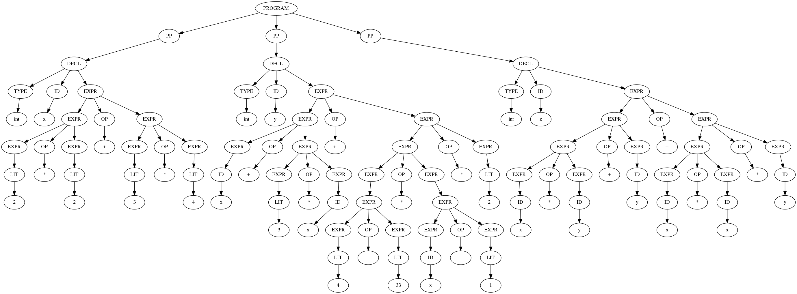

# Compiler Project

This project is for learning purposes only.

We implement a compiler for a simple language. The compiler will be divided
into the following parts:

* a *lexer*: process the input and generates a list of tokens; 

* an [LR(1)](https://en.wikipedia.org/wiki/LR_parser) *parser*: generates an 
[Abstract Syntax Tree](https://en.wikipedia.org/wiki/Abstract_syntax_tree)
-- or AST;

* a *scope checker*: builds a symbol table for each scope of the program
and checks whether all variables and functions used have been declared, and
if there are redeclarations;

* a *type checker*: checks whether assignments and expressions have the
expected type;

* a *code generator*: generates x64 assembly code targeted at
Linux. The resulting assembly will be processed by `nasm` into object 
code, and then linked with `ld`.

* and a *standard library*: functions that can be included by **ulp** programs,
and are automatically linked in the linkage phase.

## The Language

An incomplete specification of the language is in the `docs`
directory. For the lexer we have [`docs/lexicon.txt`](docs/lexicon.txt), and
for the parser we have [`docs/grammar.txt`](docs/grammar.txt). For now,
the language will just be called **ulp**, for "uma linguagem de programação".

Many examples of simple **ulp** programs can be found at the 
[`test/cases`](test/cases) directory.

## Building and Using the compiler

To build the compiler, use `make`:

    $ make

This will create the compiler at `build/ulpc`. To execute, from the `build`
directory:

    $ ./ulpc --help
    ulpc -- The ulp compiler.
    Version: 0.0.7

This will display `ulpc`'s help. To compile a file (so far some an incomplete
assembly code will be printed to `stdout`):

    $ ./ulpc /path/to/my/source/file.ul

### Testing the Compiler

To test the compiler, a series of **ulp** programs in the `test/cases` 
directory can be automatically executed via the test script:

    $ aux/test
    Running test suite...

    Positive tests:
	    pass 0001_noop.ul
	    pass 0002_noops.ul

    <output truncated ... >

    	pass 0221_undeclared_func.ul
	    pass 0225_declared_wrong.ul
	    pass 0226_declared_wrong.ul

    92 tests, 56 passes and 36 failures.

The passes and fails are displayed in green and red, respectively.

### Inspecting Parse Trees

If you have `graphviz` installed in your machine, you can check the 
parse trees by using the auxiliar script in `aux/view`:

    $ aux/view docs/current.ulp

This is an example of AST:

## Roadmap

Currently, the compiler is capable of parsing the program
[`docs/current.ulp`](docs/current.ulp). Our plans for the next versions are:

Version **0.0.x**: each merge to master should increase `x`.

Version **0.1.0**: some executable being generated. Doesn't have to be the
full language, just a small subset of it (for example: just int arithmetic).

